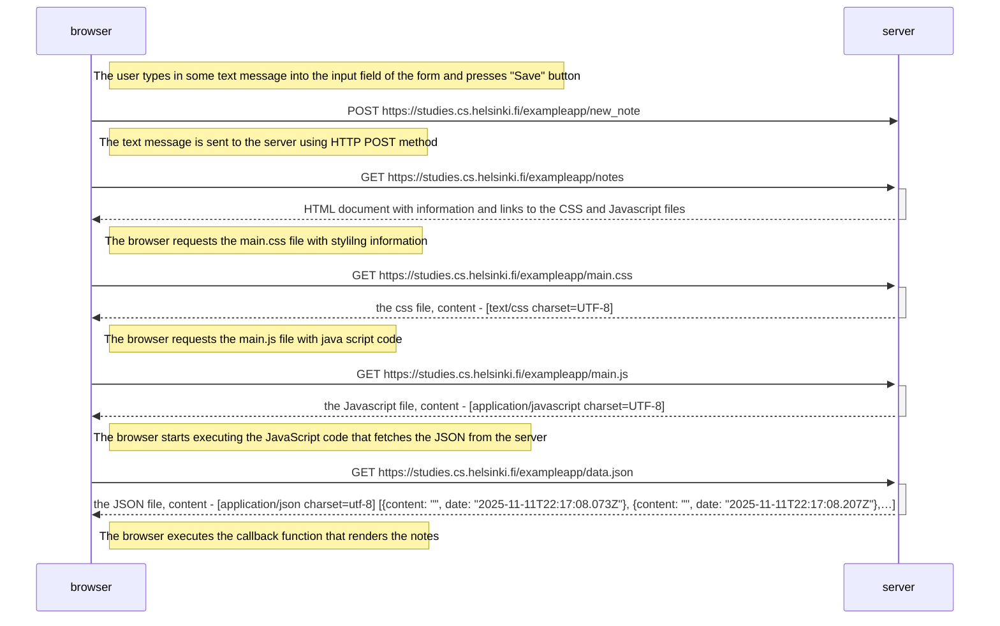

```mermaid
sequenceDiagram
participant browser
participant server

    Note right of browser: The user types in some text message into the input field of the form and presses "Save" button

    browser->>server: POST https://studies.cs.helsinki.fi/exampleapp/new_note
    activate server

    Note right of browser: The text message is sent to the server using HTTP POST method

    browser->>server: GET https://studies.cs.helsinki.fi/exampleapp/notes
    activate server
    server-->>browser: HTML document with information and links to the CSS and Javascript files
    deactivate server

    Note right of browser: The browser requests the main.css file with stylilng information
    
    browser->>server: GET https://studies.cs.helsinki.fi/exampleapp/main.css
    activate server
    server-->>browser: the css file, content - [text/css charset=UTF-8]
    deactivate server

    Note right of browser: The browser requests the main.js file with java script code

    browser->>server: GET https://studies.cs.helsinki.fi/exampleapp/main.js
    activate server
    server-->>browser: the Javascript file, content - [application/javascript charset=UTF-8]
    deactivate server

    Note right of browser: The browser starts executing the JavaScript code that fetches the JSON from the server

    browser->>server: GET https://studies.cs.helsinki.fi/exampleapp/data.json
    activate server
    server-->>browser: the JSON file, content - [application/json charset=utf-8] [{content: "", date: "2025-11-11T22:17:08.073Z"}, {content: "", date: "2025-11-11T22:17:08.207Z"},…]
    deactivate server

    Note right of browser: The browser executes the callback function that renders the notes
```
